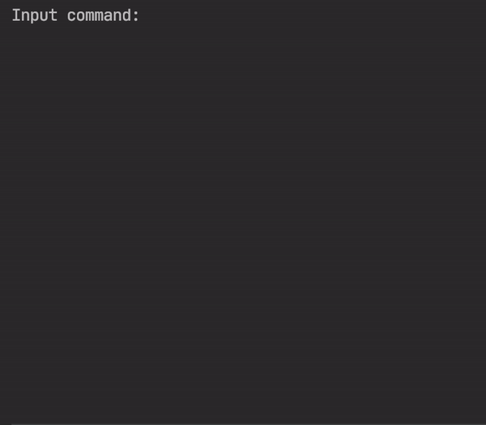

# MiniMax Tic Tac Toe
## Preview

## About
A CLI implementation of the MiniMax algorithm in Tic Tac Toe without any external libraries in Python.

## Running
Clone/Download this repository, open up a terminal in it and run:
```sh
python tic_tac_toe.py
```

## Playing
While the `input command:` message is displayed, you can either start a game or exit the program.

Starting a game is done by running `start player_1 player_2`, where `player_1` and `player_2` can be any of the following: `user`, `easy`, `medium`, `hard`. These specify whether the given player will be played by the user, an easy bot, a medium bot or the hard bot (the MiniMax algorithm), respectively. For example, typing `start medium user` and pressing enter will start a game with the first player being played by the medium-difficulty bot and the second player being the human player (assuming no :robot: is playing this!)

To exit the program type `exit` and press enter.

I hope you enjoy! :innocent: